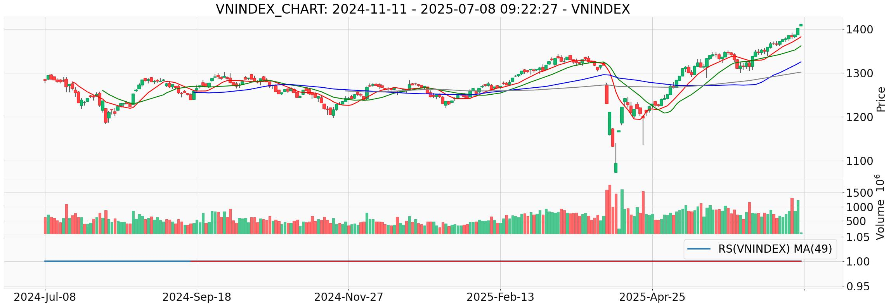
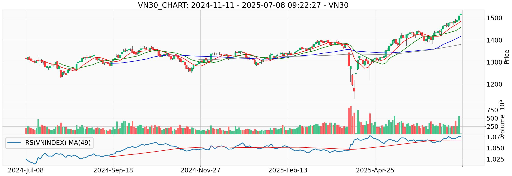

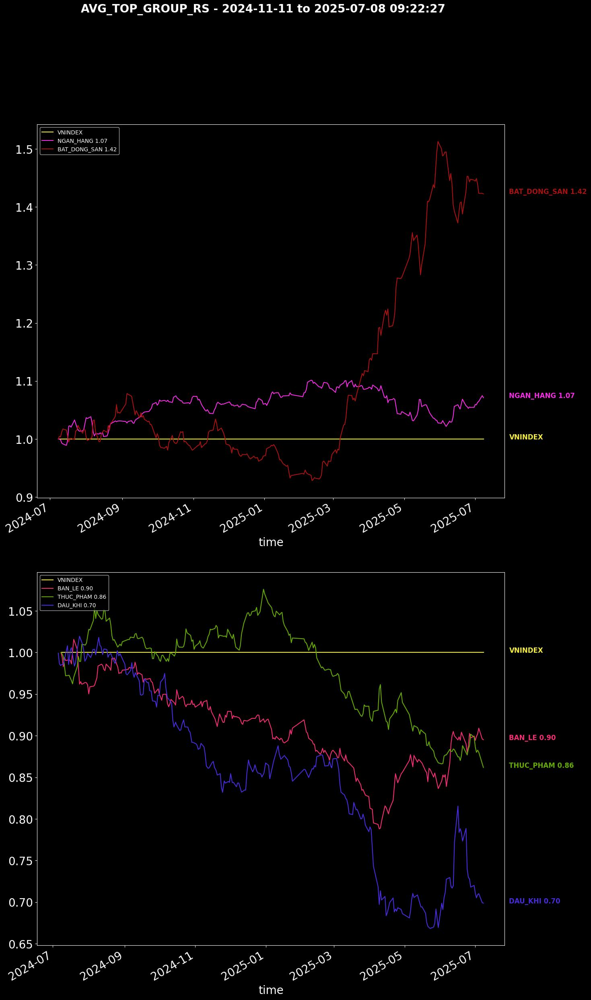
US_TECH

US_UTILITIES

US_INDUSTRIALS

US_REAL_ESTATE

US_HEALTHCARE

US_FINANCIALSERVICES

US_ENERGY

US_BASIC_MATERIALS

US_CONSUMER_DEF

NGAN_HANG
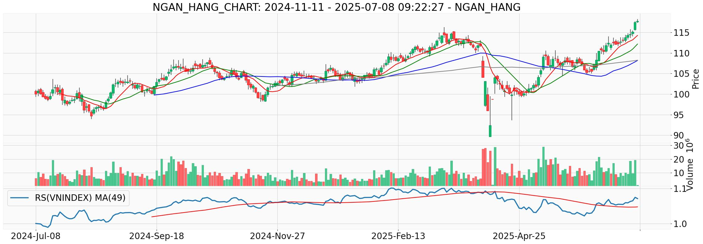
BAN_LE
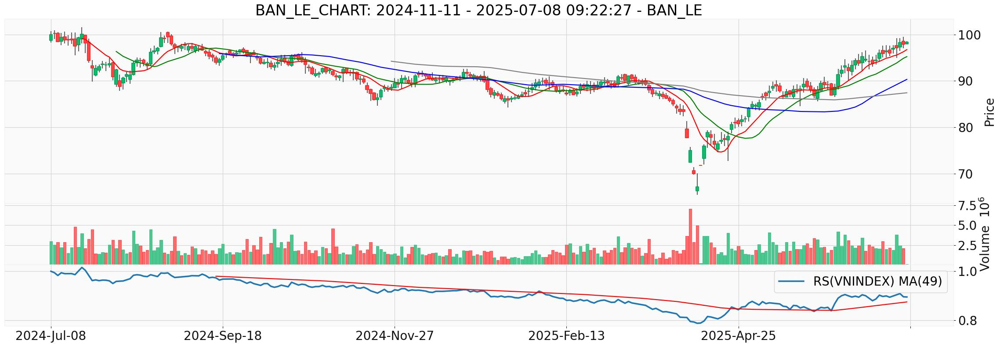
BAT_DONG_SAN
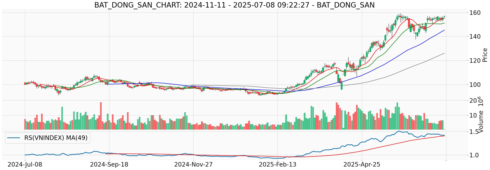
TAI_CHINH
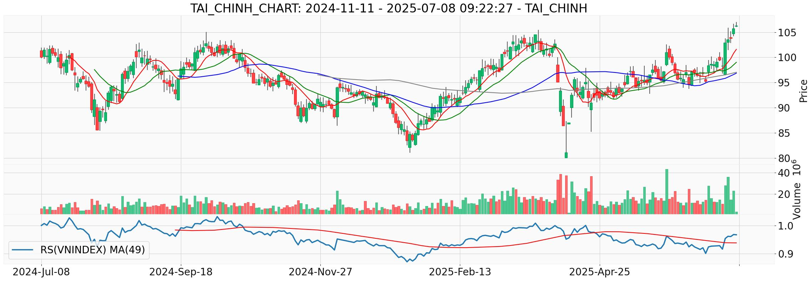
HANG_CA_NHAN
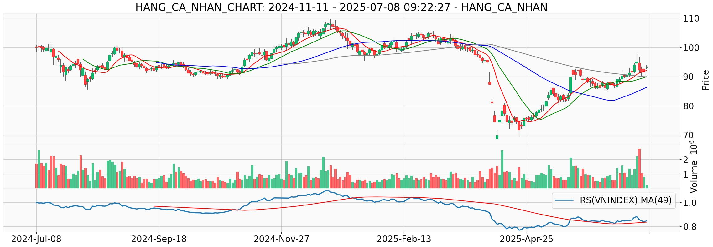
THUC_PHAM
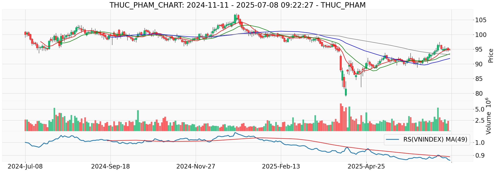
TAI_NGUYEN

XAY_DUNG
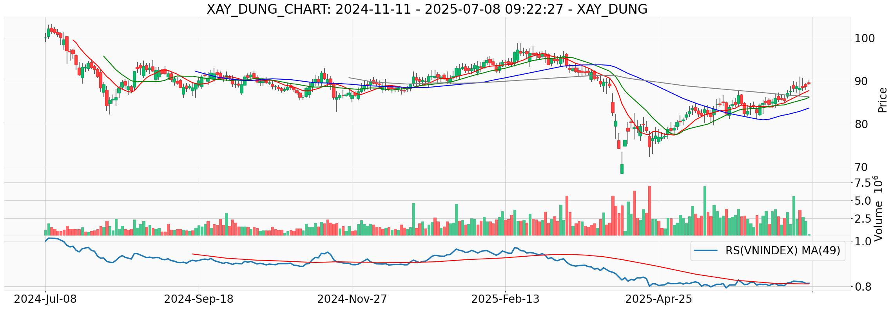
DIEN_NUOC_XANG
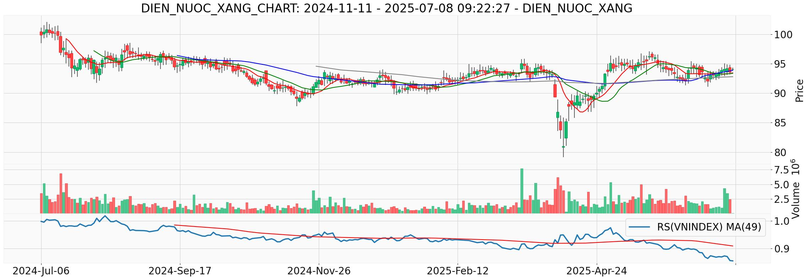
DAU_KHI
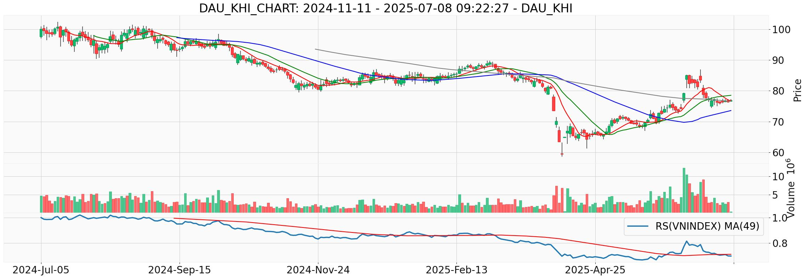
DICH_VU_CONG_NGHIEP
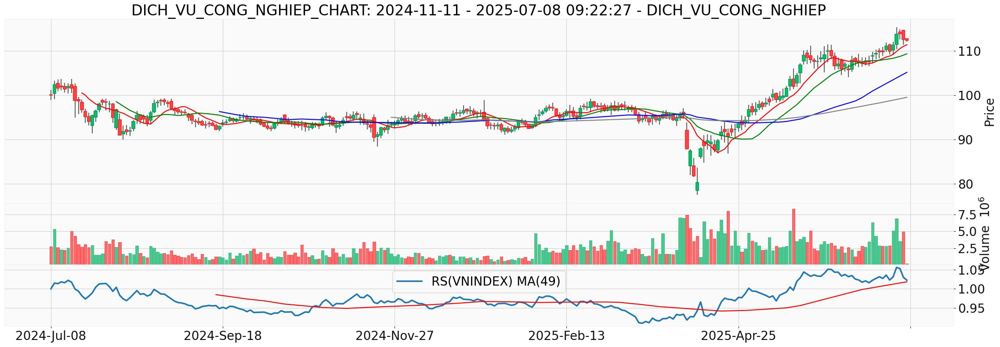
CONG_NGHE
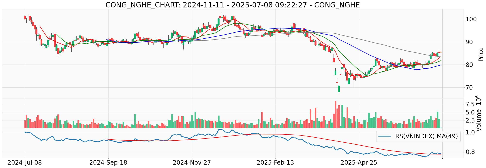
BAO_HIEM
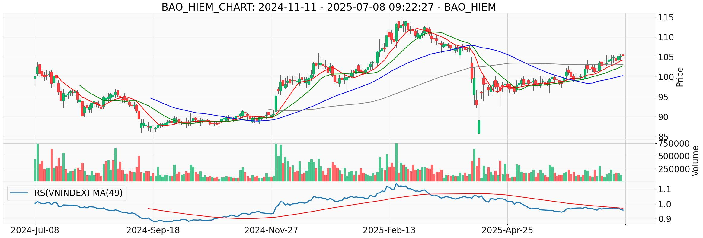
HOA_CHAT
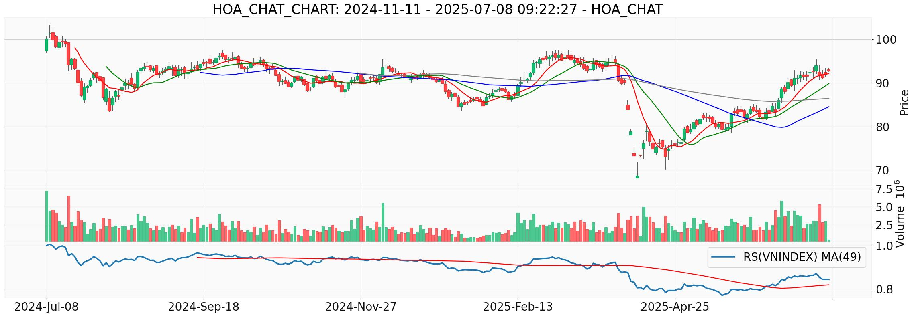
OTO_PHU_TUNG
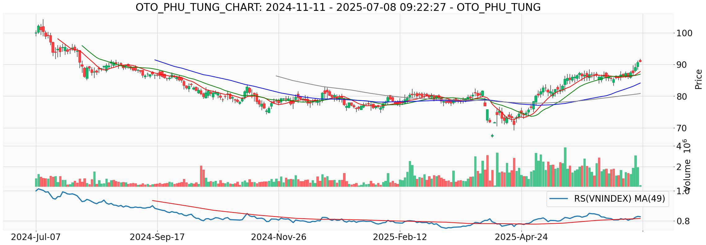
DU_LICH

VIEN_THONG
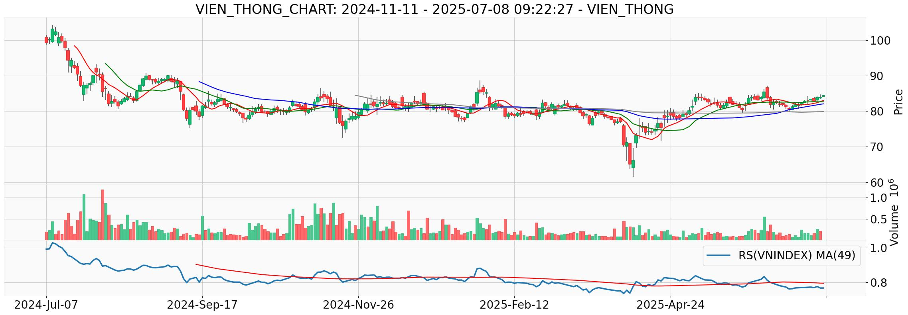
Y_TE
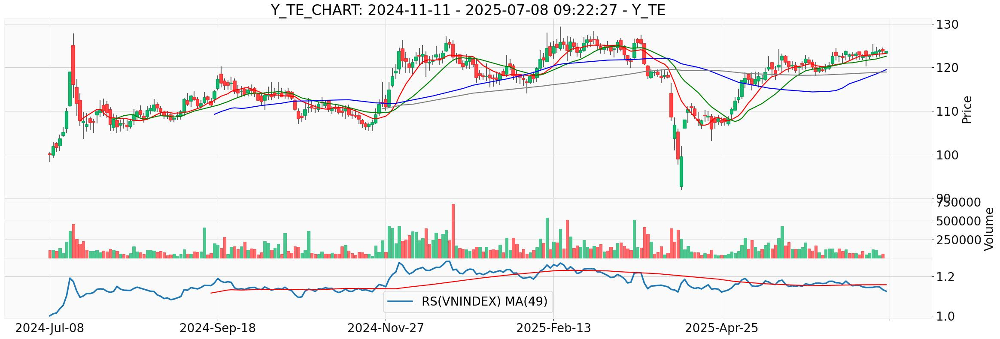
